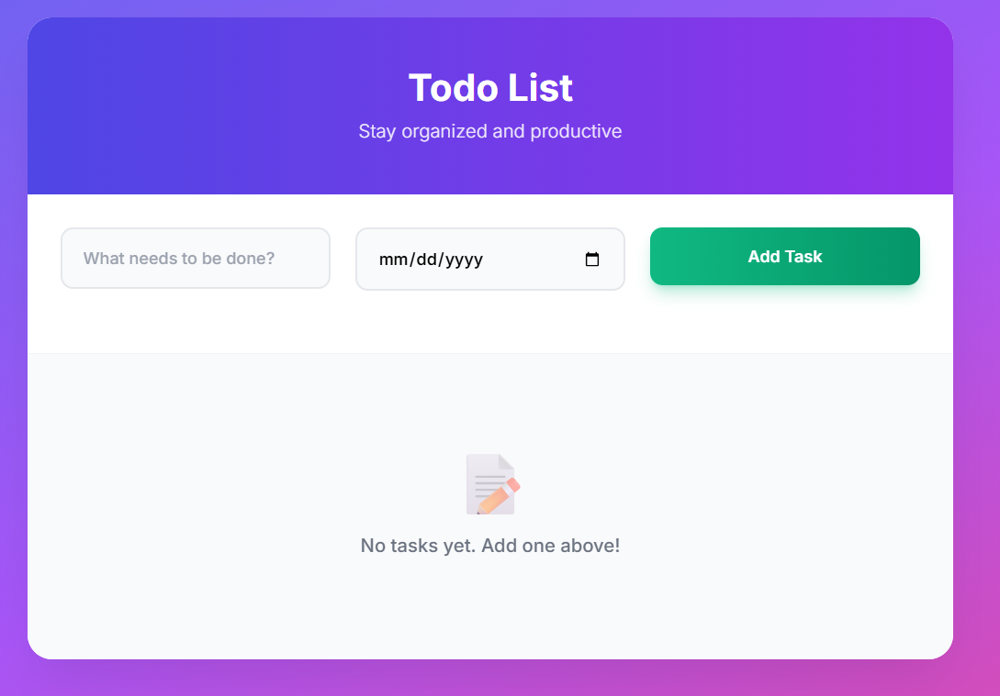
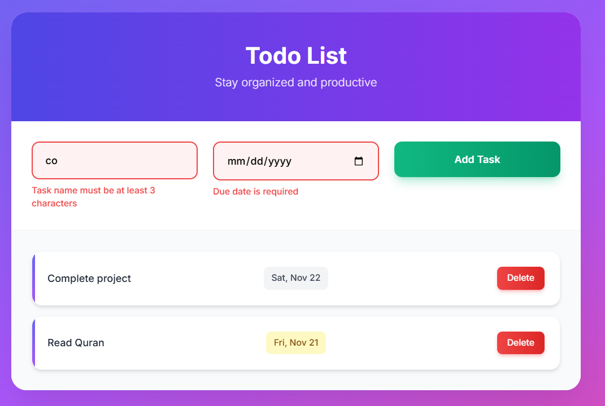

# 📝 Modern Todo List Application

A sleek, professional todo list application built with TypeScript and Tailwind CSS, featuring comprehensive validations and modern 3D design.

---

🔗 **Live Demo:**  
[🌐 View Project](https://maazcodecraft.github.io/todo-list/todo-list.html)

---

## 📸 Screenshots

Here's how the project looks in action:




## 🛠️ Tech Stack

- **TypeScript** - Type-safe JavaScript
- **Tailwind CSS** - Utility-first CSS framework
- **Vanilla JavaScript** - No framework dependencies
- **Local Storage API** - Client-side data persistence

## 🚀 Getting Started

### Prerequisites

- Node.js (for TypeScript compilation)
- Modern web browser
- Text editor/IDE

### Installation

1. **Clone or download** the project
2. **Install dependencies**:

   ```bash
   npm install
   ```

3. **Compile TypeScript** (optional):

   ```bash
   npm run build
   ```

4. **Open** `todo-list.html` in your browser

### Development

- **Watch mode** for TypeScript:
  ```bash
  npm run watch
  ```

## 📱 Usage

1. **Add Tasks**: Enter task name and due date, click "Add Task" or press Enter
2. **View Tasks**: See all tasks with formatted dates and status indicators
3. **Delete Tasks**: Click the delete button on any task
4. **Status Indicators**:
   - 🟡 **Today** - tasks due today
   - 🔴 **Overdue** - past due tasks
   - ⚪ **Upcoming** - future tasks

## 🎯 Validation Rules

- **Task Name**: 3-100 characters, no duplicates
- **Due Date**: Cannot be in the past
- **Both fields**: Required for submission

**Made with ❤️ using TypeScript and Tailwind CSS**
